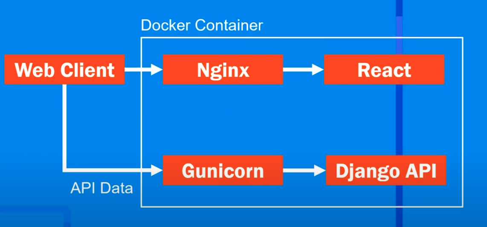
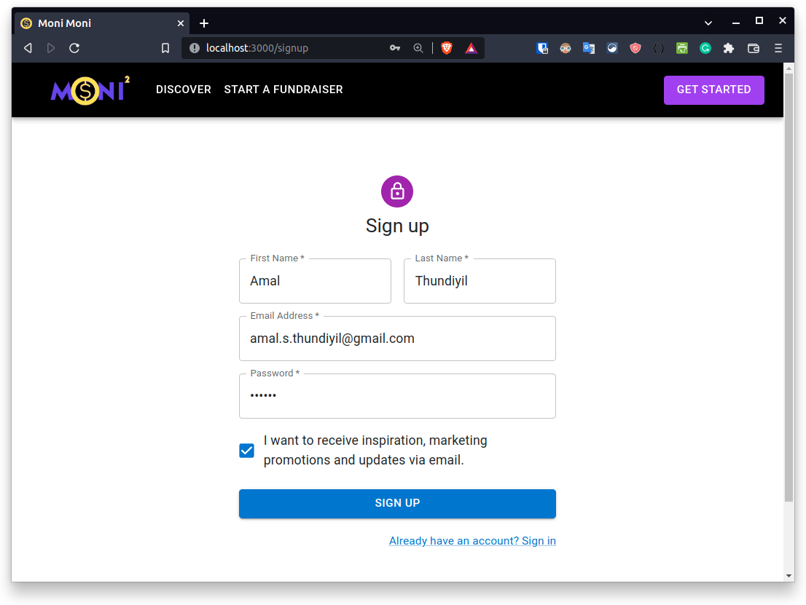
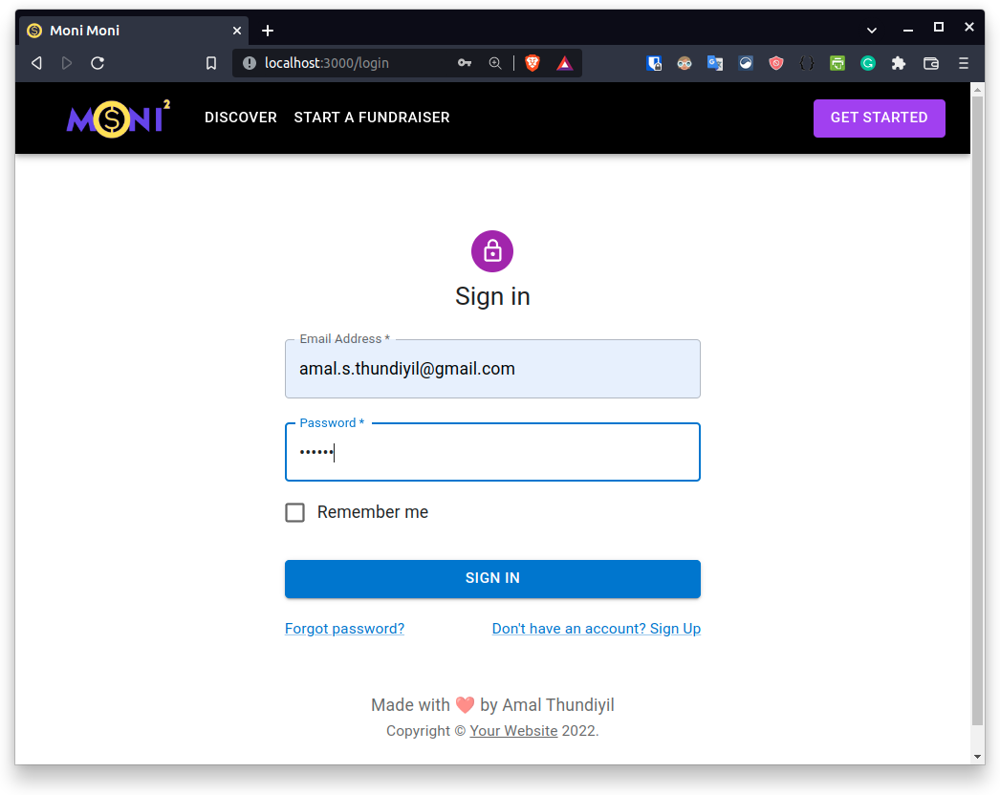

<p align='center'>

</p>

<h1>
<p align='center'>
Moni Moni - Crowdfunding Platform
</p>
</h1>

<p align='center'>

<a href="https://github.com/amal-thundiyil/moni-moni/blob/main/LICENSE">
<a href="https://github.com/amal-thundiyil/moni-moni/pulls"></a>
<a href="https://github.com/amal-thundiyil/moni-moni/issues"></a>


</p>

<h3>
<p align='center'>
🚧 Moni Moni is live <a href="https://moni-moni.herokuapp.com/">here</a> 🚧
</p>
</h3>

## 📌 Introduction

Moni Moni is fundamentally a crowdfunded small-scale loaning service. Users can post their loan requests along with the interest they can payback and the reason they want money for, other users can view the request and decide whether they want to invest in the person depending upon the interest rate and the reason for request.

## 👨‍💻️ Technology Stack

- [React.js](https://github.com/facebook/react)
- [Material UI](https://github.com/mui/material-ui)
- [Django](https://github.com/django/django)
- [Amazon Web Services (AWS)](https://github.com/aws)

## 🙏 Contributing

Please read the [contributing guidlines](CONTRIBUTING.md). To setup this project locally:

### 🐳 Using Docker

With Docker and docker-compose installed, run docker-compose up --build

```sh
docker-compose up --build
```

Open the browser at http://localhost:3000/. 👨‍🏭️

### 🛠️ Other alternative

Change the directory to the `moni-moni/client/` folder and run:

```
npm start
```

Change the directory to the `moni-moni/server/` folder and run:

```sh
python3 -m venv venv
source venv/bin/activate
pip install -r requirements.txt
python manage.py runserver
```

Open the browser at http://localhost:3000/. 👨‍🏭️

## 🎓 Description

This is the overview of the architecture of the web application:

<p align="center">
    
</p>

### Screenshots

#### Signup Page
<p align="center">
    
</p>

#### Login Page
<p align="center">
    
</p>

## 📝 Further Changes to be Done

- [ ] Add options to accept funding made with NFTs and digital currency.
