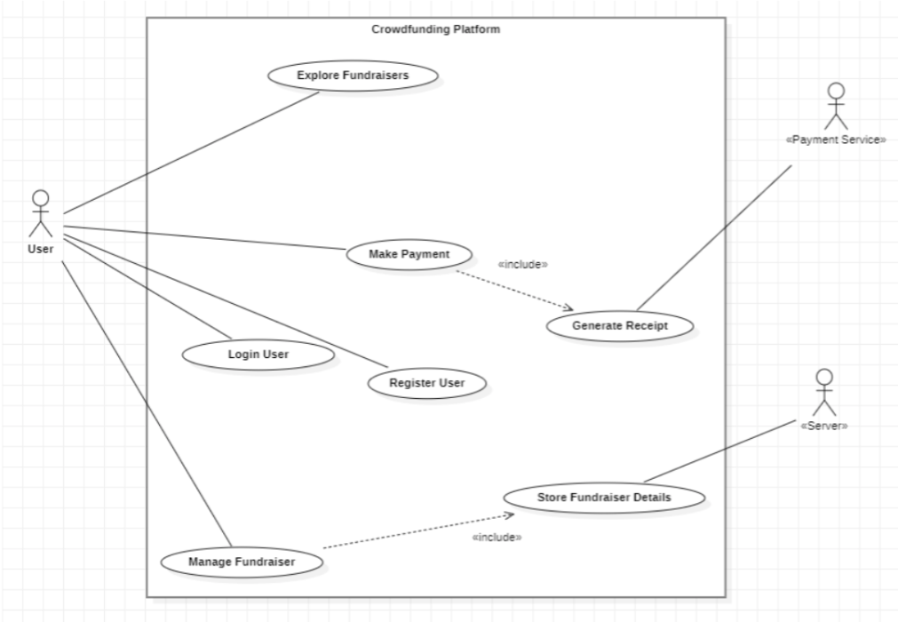
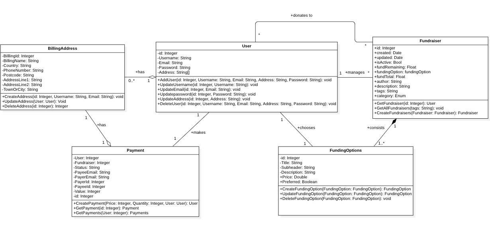
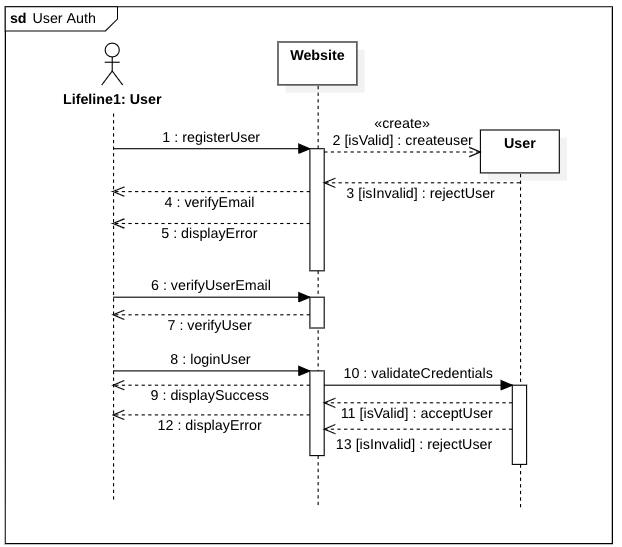
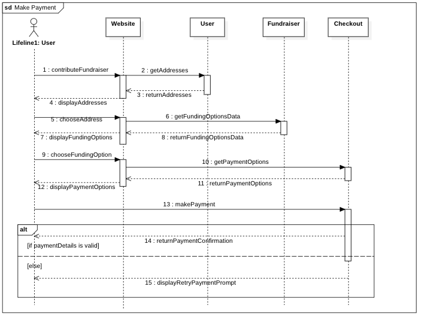

# ️Software Engineering Diagrams

Use Case Diagram

Class Diagram

Sequence Diagram - User Auth

Sequence Diagram - Make Payment

## Users and Characteristics

The system consists of two types of main users i.e Donors and fundraiser creators. Other users include the spectators. The system is also designed to be user-friendly. It uses a Graphical
User Interface (GUI). Types of users:

- Donors: These are the users who are responsible for adding funds to the fundraiser. They can choose to validate the reasons of the fundraiser creator and then choose to add funds.
- Fundraiser Creator: The fundraiser creator is responsible for creating the fundraiser and outlining the details required for a meaningful fundraiser.
- Spectators: These are the people who can choose to contribute to any fundraiser they come across.

## Design and Implementation Constraints

- Verification of fundraisers: The software doesn’t provide any ability for the fundraiser to be payment to be verified. There might even be fundraisers which were not expired by the user or fake users creating multiple fundraisers with the same account. There security risks are not mitigated in this platform. User discretion is advised.
- Tracking of fundraisers: The software doesn’t provide any ability for the fundraiser to be payment to be tracked. The crowdfunding platform is merely a platform to connect the fundraiser creator to the potential donors/contributors.
- Legally compliant payment system: To make the payment legally compliant, no real payments are executed. All payments will be made using a dummy account.
